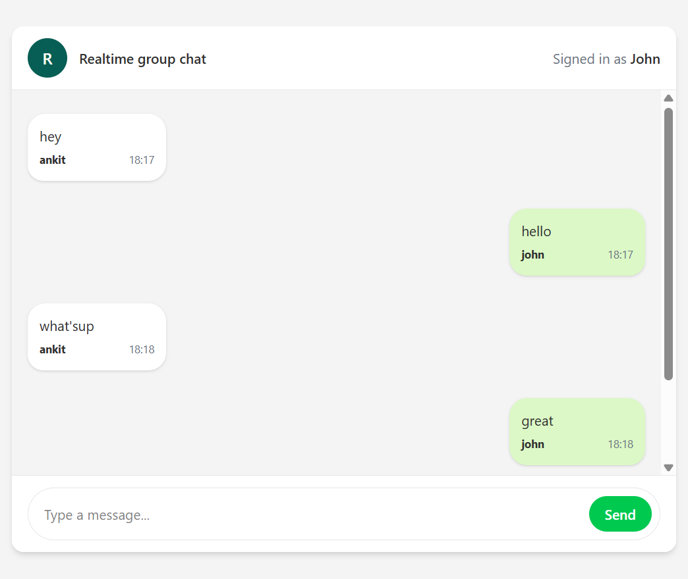

# 💬 Live Chat App

A real-time chat application that enables users to communicate instantly through WebSockets. Built using React, Node.js, Express, and Socket.IO.

## 🚀 Live Demo

🔗 [Live Demo](https://group-chat-app-e6bx.vercel.app/)

## 📸 Screenshots

### Chat Interface



## ✨ Features

- Real-time messaging
- Multiple users support
- Responsive UI
- Fast communication with Socket.IO
- Clean and modern design

## 🛠️ Tech Stack

- React.js
- Node.js
- Express.js
- Socket.IO
- CSS

## 📂 Project Structure

```text
REACT-CHAT/
│
├── frontend/
├── backend/
├── screenshots/
└── README.md